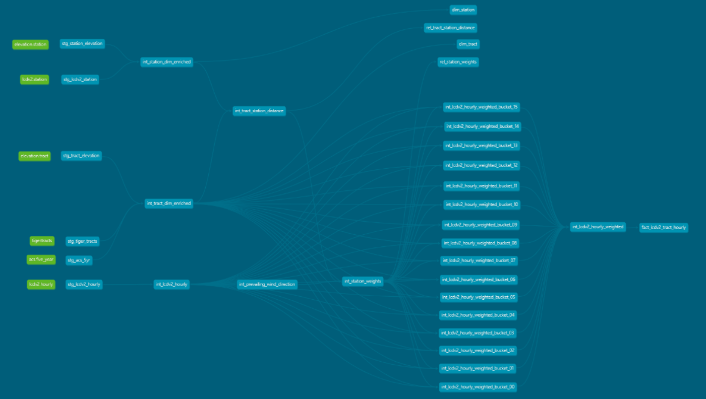

# ARCHITECTURE.md — Project Architecture

This document describes the end-to-end architecture of the ML Feature Pipeline, from raw data ingestion through final tract-level hourly weather features. The architecture is intentionally layered to separate concerns, improve clarity, and support efficient execution.

---

## 1. High-Level Overview

The pipeline consists of two major components:

1. A Python ingestion and normalization system.
2. A dbt transformation system that builds tract-level hourly weather features.

Overall flow:

Raw External Data  
   ↓  
Python Ingestion & Normalization  
   ↓  
Normalized Parquet Files (e.g., "data/normalized/...")  
   ↓  
dbt Staging Models  
   ↓  
dbt Intermediate Models    
   ↓  
dbt Final Models  

---

## 2. Layer Breakdown

### 2.1 Ingestion Layer (Python)

Responsibilities:

- Download and normalize external datasets:
  - NOAA LCDv2 station metadata
  - NOAA LCDv2 hourly weather.
  - TIGER/Line tract geometries.
  - ACS 5-year demographic estimates.
  - Station and tract elevation datasets.
- Perform geospatial operations:
  - Centroid calculation.
- Enforce schema consistency.
- Partition LCDv2 hourly data by station and year.
- Produce normalized Parquet files under directories such as:
  - "data/external/lcdv2_stations.parquet"
  - "data/normalized/lcdv2/"
  - "data/normalized/tiger_tracts.parquet"
  - "data/normalized/acs_5yr.parquet"
  - "data/raw/elevation/station_elevation.parquet"
  - "data/raw/elevation/tract_elevation.parquet"

This layer handles all heavy lifting before dbt.

---

### 2.2 Staging Layer (dbt)

Responsibilities:

- Read normalized Parquet files.
- Perform minimal transformations:
  - Type casting.
  - Column renaming.
  - Basic structural cleanup.
- Preserve the ingestion schema with minimal modification.

Staging models include:

- "stg_lcdv2_hourly"
- "stg_lcdv2_station"
- "stg_tiger_tracts"
- "stg_acs_5yr"
- "stg_station_elevation"
- "stg_tract_elevation"

---

### 2.3 Intermediate Layer (dbt)

This layer performs the core relational and algorithmic transformations.

Key models:

- "int_tract_station_distance"  
  Computes tract–station distances, bearings, and elevation differences.

- "int_prevailing_wind_direction"  
  Computes seasonal prevailing wind direction per station.

- "int_station_weights"  
  Computes distance factor, elevation penalty, wind alignment, raw weight, and normalized final weight.

- "int_lcdv2_hourly"  
  Floors timestamps, aggregates and prepares subhourly observations into hourly station-level weather values.

These models form the backbone of the weighting and aggregation logic.

---

### 2.4 Intermediate Layer Continued - Tract Buckets (dbt)

Sixteen parallel models:

- "int_lcdv2_hourly_weighted_bucket_00"
- ...
- "int_lcdv2_hourly_weighted_bucket_15"

One union model:

- "int_lcdv2_hourly_weighted"

Responsibilities:

- Partition tracts into spatial buckets.
- Compute weighted hourly weather features per bucket.
- Reduce memory pressure and improve runtime performance.
- Enable parallel execution within dbt.

Each bucket produces weighted hourly weather values for its subset of tracts.

These subsets are then unioned into a final weighted model.

---

### 2.5 Final Layer (dbt)

Thin wrapper models that expose clean, stable interfaces:

- "dim_tract"  
  Tract dimension table.

- "dim_station"  
  Station dimension table.

- "rel_station_weights"  
  Tract–station–season weighting relationships.

- "rel_tract_station_distance"  
  Tract–station distance and bearing relationships.

- "fact_lcdv2_tract_hourly"  
  Final tract-level hourly weather fact table.

These models are intentionally simple `SELECT * FROM {{ ref(...) }}` wrappers to provide semantic clarity and stable schemas for downstream consumption.

---

## 3. Execution Flow

1. Python ingestion produces normalized Parquet files.
2. dbt staging models read these files.
3. Intermediate models compute distances, weights, and hourly values.
4. Bucket models aggregate weighted hourly weather features in parallel, which are then unioned together.
5. Final models expose clean dimensional and fact tables.

---

## 4. DAG Structure

The dbt DAG (visible via "dbt docs serve") shows:

- A clear separation between staging, intermediate, and final layers.
- Parallel execution paths for the 16 bucket models.
- Clean lineage from ingestion → staging → intermediate → final.
- A single convergence point at "fact_lcdv2_tract_hourly".

---

## 5. Summary

The architecture is designed to:

- Separate ingestion from transformation.
- Keep dbt focused on relational logic and weighting algorithms.
- Enable parallel execution through tract bucketization.
- Provide clean, stable final models for downstream ML pipelines.
- Maintain clarity, modularity, and performance across the entire workflow.

This layered architecture ensures the pipeline is maintainable, scalable, and easy to reason about, while producing high-quality tract-level hourly weather features.
