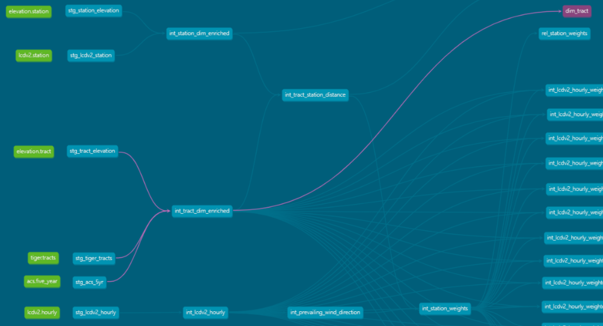
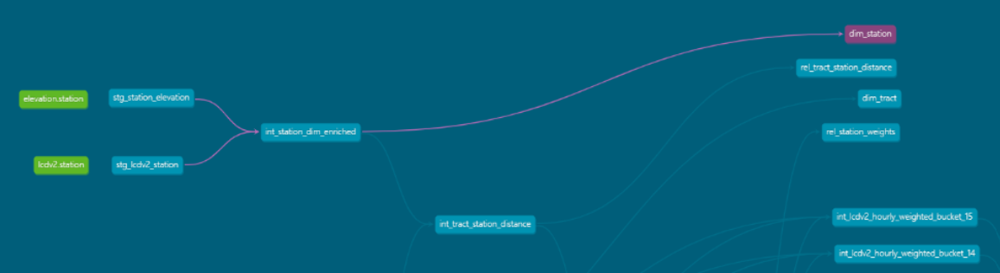
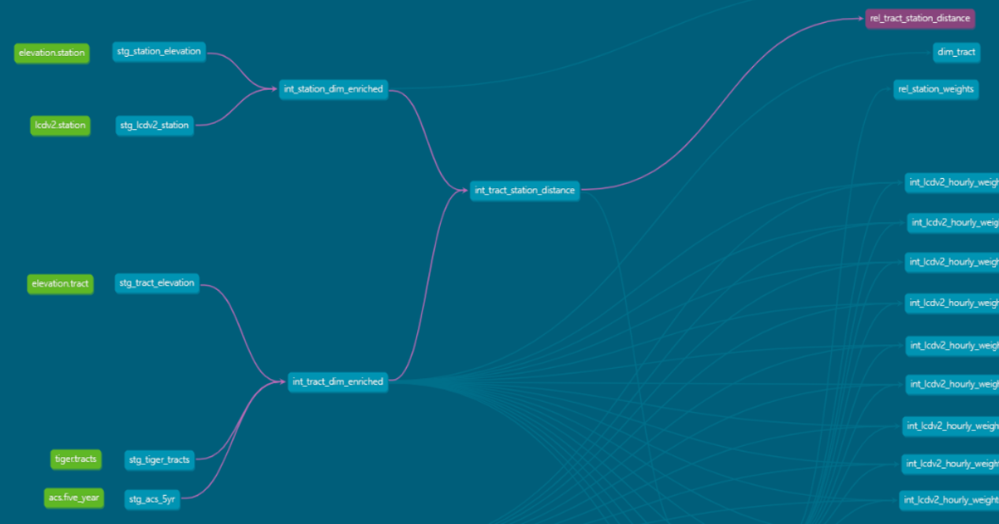
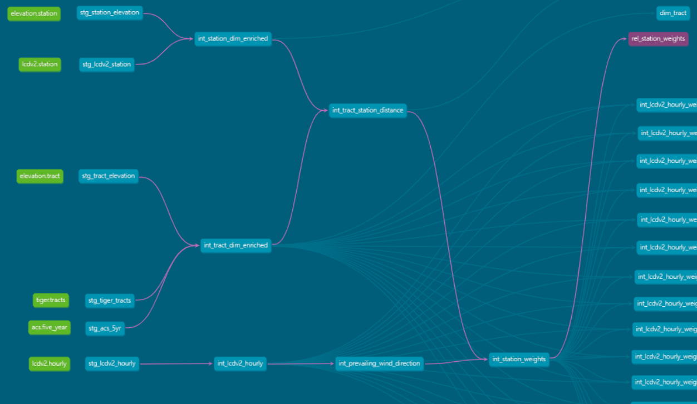

# DAG.md — Pipeline Lineage & DAG Walkthrough

A curated walkthrough of the dbt DAG as generated by `dbt docs serve`.  
This document focuses on **targeted DAG slices** for each final model. These slices highlight the upstream dependencies that feed each final output table and illustrate how the pipeline’s layered structure produces clean, interpretable results.

Each section includes:
- a screenshot for the DAG slice
- a concise explanation of the upstream lineage with a description of how that lineage supports the model’s purpose

---

## 1. How to Interpret the DAG

The dbt DAG shows:
- **nodes** representing models
- **edges** representing dependencies
- **layering** that reflects the pipeline’s architecture (staging → intermediate → final)
- **parallel branches** (the 16 bucket models)
- **convergence points** (final models)

---

## 2. Final Model DAG Slices

The final layer consists of five models:
- "dim_tract"
- "dim_station"
- "rel_tract_station_distance"
- "rel_station_weights"
- "fact_lcdv2_tract_hourly"

Each section below shows the DAG slice for one final model and explains its upstream lineage.

---

### 2.1 dim_tract

**DAG Slice Screenshot:**  

**Explanation:**  
The DAG slice for "dim_tract" highlights the tract‑related staging and intermediate models that feed into the final tract dimension. These include:
- normalized TIGER/Line tract geometry
- tract centroids and bounding boxes
- tract elevation
- ACS demographic attributes
- tract bucket assignments

This lineage shows how geospatial, demographic, and structural tract attributes converge into a single, clean dimension table. "dim_tract" serves as the geographic and socioeconomic anchor for all tract‑level weather features.

---

### 2.2 dim_station

**DAG Slice Screenshot:**  

**Explanation:**  
The DAG slice for "dim_station" highlights the station‑related staging and intermediate models, including:
- normalized station metadata
- station elevation

"dim_station" provides the physical and operational characteristics of each weather station used in weighting and aggregation.

---

### 2.3 rel_tract_station_distance

**DAG Slice Screenshot:**  

**Explanation:**  
The DAG slice for "rel_tract_station_distance" shows the geospatial intermediate models that compute:
- haversine distance between tract centroids and stations
- bearing from station to track
- elevation differences

These upstream dependencies form the geospatial backbone of the pipeline. This relational table encodes the physical relationships between tracts and stations and supports distance taper, elevation penalty, and wind alignment in the weighting layer.

---

### 2.4 rel_station_weights

**DAG Slice Screenshot:**  

**Explanation:**  
The DAG slice for "rel_station_weights" highlights the intermediate models responsible for:
- distance taper
- elevation penalty
- wind alignment
- additive raw weight calculation
- normalized final weight per tract‑season

This lineage shows how geospatial, elevation, and wind‑based factors combine to produce a physically meaningful weighting system. "rel_station_weights" exposes the full weighting logic used to compute tract‑level hourly weather features.

---

### 2.5 fact_lcdv2_tract_hourly

**DAG Slice Screenshot:**  

**Explanation:**  
The DAG slice for "fact_lcdv2_tract_hourly" shows the convergence of all 16 bucket models, each responsible for computing weighted hourly weather features for a subset of tracts. Upstream dependencies include:
- hourly LCDv2 staging
- tract–station distance and bearing
- station weights
- tract_bucket weighted aggregations

This slice illustrates the pipeline’s parallelization strategy: tract partitioning enables efficient computation across large datasets. The fact table represents the final, fully aggregated tract‑level hourly weather dataset used for downstream machine learning feature engineering.

---

## 3. Summary

This DAG walkthrough highlights how each final model is supported by a clean, layered set of upstream transformations. By focusing on per‑model DAG slices rather than the full DAG, this document provides a clear view of how the pipeline’s architecture produces stable, interpretable, and production‑ready ML feature store outputs.
